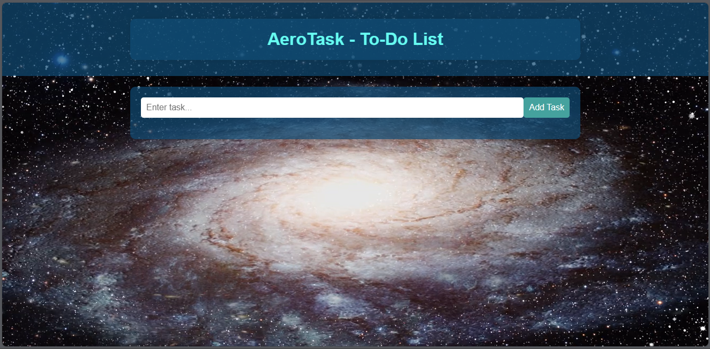

# AeroTask - To-Do List

Welcome to AeroTask - a stylish and interactive to-do list website with an aerospace theme.

## Description

AeroTask is a web application that allows you to manage your tasks in a visually appealing and user-friendly environment. The design is inspired by the aerospace theme to give it a unique and modern look.

## Features

- Add tasks to your to-do list.
- Edit existing tasks.
- Delete tasks.
- User-friendly interface with an aerospace theme.

## Preview



## Video Background

The video background used in this project is from Pixabay. You can find the video [here](https://pixabay.com/videos/galaxy-spinning-zooming-in-19641/).

## Installation

1. Clone the repository:

   ```bash
   git clone https://github.com/IsharaParanagamaGedara/AeroTask-To-Do-List.git
   ```

2. Open the project folder:

   ```bash
   cd AeroTask-To-Do-List
   ```

3. Open the `index.html` file in your preferred web browser.

## Usage

- Add a task using the input form.
- Edit a task by clicking the "Edit" button.
- Delete a task by clicking the "Delete" button.

## Customization

Feel free to customize the project to suit your preferences:

- Change the video background by replacing the `aero-video-file.mp4` in the `<source>` tag in `index.html`.
- Modify the colors and styles in the `styles.css` file to create your own theme.

## Acknowledgments

- Video background from [Pixabay](https://pixabay.com/videos/galaxy-spinning-zooming-in-19641/).


